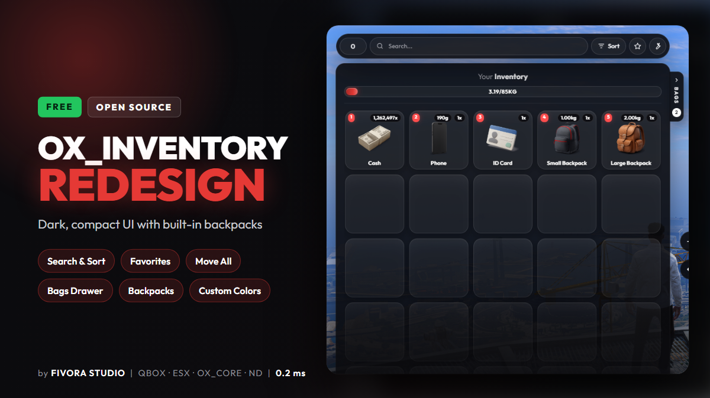
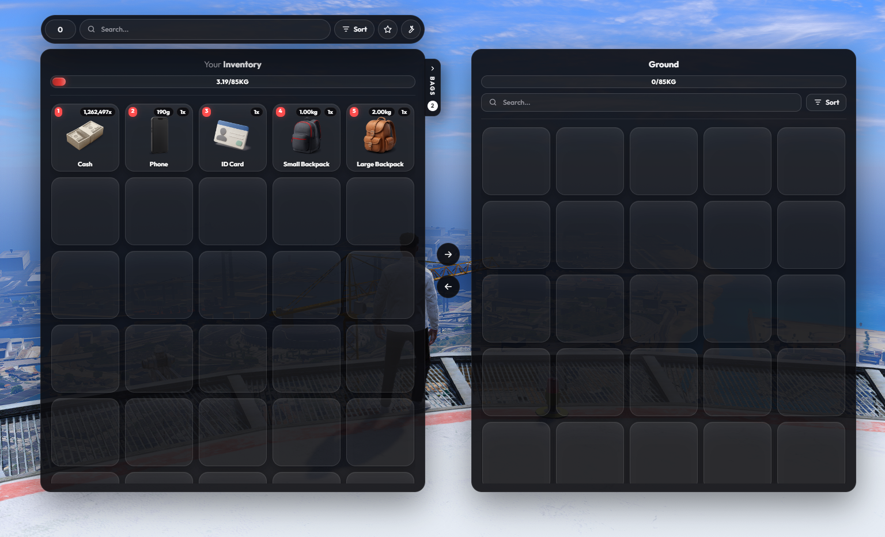
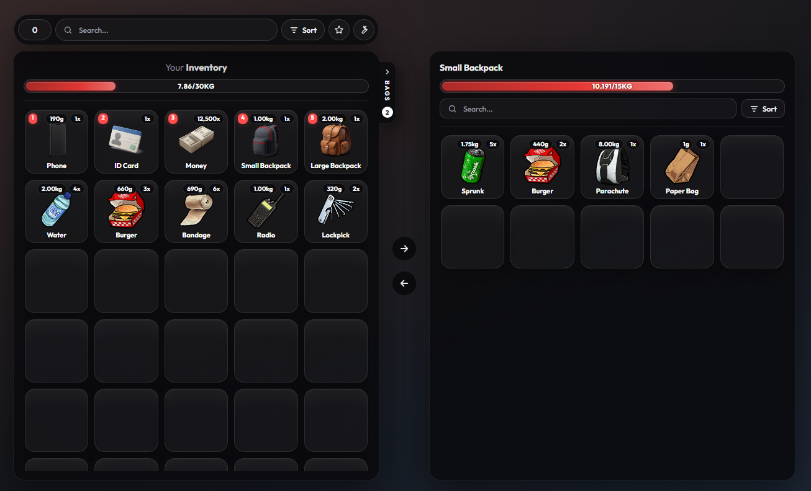
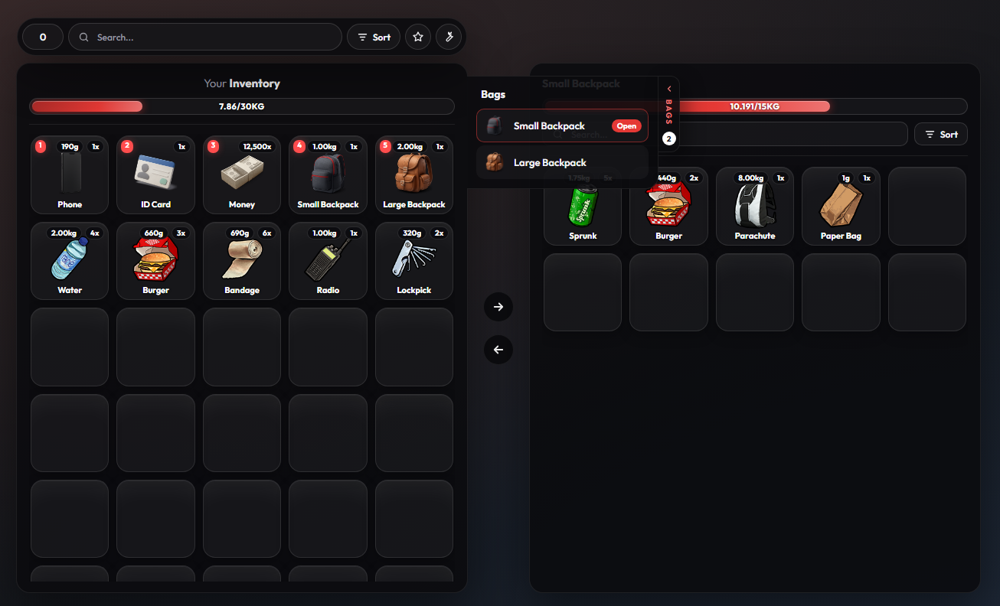
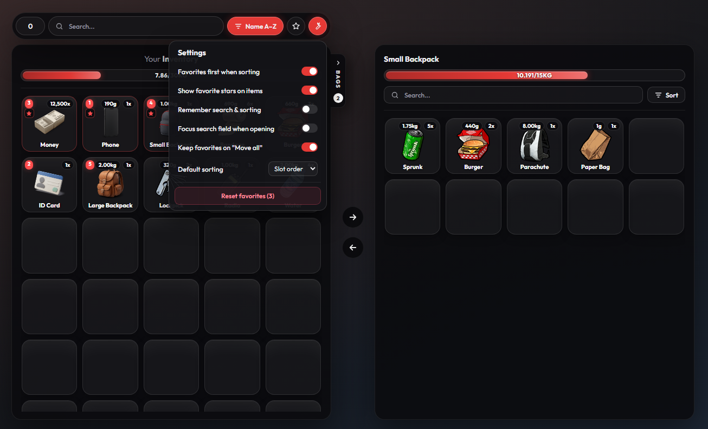

<div align="center">



# ox_inventory – Redesign

A dark, compact redesign of [ox_inventory](https://github.com/overextended/ox_inventory) with a toolbar (search, sorting, favorites), one-click "move all", a bags drawer, built-in backpacks and a configurable accent color.

Based on **ox_inventory v2.47.9** by [Overextended](https://github.com/overextended). All original features and exports still work.

[](https://discord.gg/fivorastudio)



</div>

<table>
  <tr>
    <td></td>
    <td></td>
    <td></td>
  </tr>
  <tr>
    <td align="center"><b>Backpack</b> – opened on the right side</td>
    <td align="center"><b>Bags drawer</b> – all backpacks you carry, click to open</td>
    <td align="center"><b>Toolbar</b> – search, sorting, favorites &amp; settings</td>
  </tr>
</table>

## ✨ What's new

### Redesign
- Dark, compact card-style slots (~20 % smaller inventory)
- "Your Inventory" title instead of the player name, "Ground" title for drops
- Weight shown centered in the header bar
- **Accent colors configurable** in `data/theme.lua` (default: red)

### Toolbar
- **Search** field for both inventories
- **Sorting**: slot order, name A–Z, name Z–A, amount (visual only, slots stay the same on the server)
- **Favorites**: star items, show favorites only, favorites first when sorting
- Own **amount field** (0 = all)
- **Settings** popup (remembered per player via localStorage)
- **Double-click** an item in your inventory to use it

### Move all
- Arrows between both inventories move **all items** (or only the current search results) to the other side
- Favorites can be kept in your inventory
- With nothing opened on the right, everything is dropped on the **ground as one pile**
- Every item goes through the normal swap logic, so weight limits, hooks, locks and logs still apply

### Bags drawer & backpacks
- **Bags** tab next to your inventory lists all containers and backpacks you carry, click to open
- **Backpacks** are built in (`modules/backpack`), no extra resource needed:
  - Each backpack has its own stash; the stash id is stored in the item metadata, so the contents move with the item
  - Backpacks cannot be put inside backpacks
  - Optional: only one backpack per player
  - Small "looking into the bag" animation while it is open
- Two backpacks are included: `backpack_small` (10 slots / 15 kg) and `backpack_large` (20 slots / 30 kg)

## 📦 Installation

1. Install [ox_lib](https://github.com/overextended/ox_lib) and [oxmysql](https://github.com/overextended/oxmysql) (same as the original ox_inventory).
2. Replace your `ox_inventory` folder with this one (keep a backup of your own `data/*.lua` files).
3. If you already have your own `data/items.lua`, add the two backpack items from this repo's `data/items.lua` (bottom of the file) and copy `web/images/backpack_small.png` and `web/images/backpack_large.png`.
4. Restart the **whole server** (restarting only ox_inventory also stops all resources that depend on it).

For everything else (framework setup, convars, exports) see the official documentation: https://overextended.dev/docs/ox_inventory

## ⚙️ Configuration

### Colors – `data/theme.lua`
```lua
return {
    accent = '#e53935',    -- hover effects, buttons, focus rings, weight bar, bags list
    highlight = '#ff4d4d', -- hotbar slot numbers, durability bar, favorites, notifications
}
```
Any hex color works; lighter/darker shades and readable text colors are derived automatically.

### Backpacks – `data/backpacks.lua`
```lua
return {
    oneBagInInventory = false, -- only one backpack per player?

    backpacks = {
        ['backpack_small'] = { label = 'Small Backpack', slots = 10, maxWeight = 15000 },
        ['backpack_large'] = { label = 'Large Backpack', slots = 20, maxWeight = 30000 },
    },
}
```
To add another size, add an entry here **and** an item with the same name and `bag = true` in `data/items.lua`.

Other scripts can open a backpack via `exports.ox_inventory:openBackpack(data, slot)` (client).

## 🔧 Changed files (compared to ox_inventory v2.47.9)

| File | Change |
|---|---|
| `web/public/assets/redesign.css` | new – redesign styles (copied to `web/build/assets/redesign.css`) |
| `web/public/assets/search.js` | new – toolbar, favorites, bags drawer, move all, theme (copied to `web/build/assets/search.js`) |
| `web/index.html` | loads `search.js` and `redesign.css` |
| `web/vite.config.ts` | `publicDir: 'public'`, so the files above end up in the build |
| `client.lua` | NUI callbacks `transferAll` / `getBags`, sends the theme to the UI |
| `modules/inventory/server.lua` | `transferAll` callback, `Inventory.RegisterStash` |
| `modules/hooks/server.lua` | `server.registerHook` for internal hooks |
| `modules/backpack/*`, `data/backpacks.lua`, `data/theme.lua` | new |
| `data/items.lua`, `server.lua` | backpack items / module |

The React source in `web/src` is unmodified ox_inventory v2.47.9. The redesign runs on top of it: `search.js` works on the DOM and `redesign.css` is loaded after the original styles. Neither needs a build step.

## 🛠️ Building the UI

The full UI source is in `web/`. `web/build` is committed, so you only need this if you want to change something.

```bash
cd web
bun install --frozen-lockfile
bun run build
```

Use [bun](https://bun.sh) (like upstream) so the versions from `bun.lock` are installed. `npm install` fails on an upstream peer dependency conflict (`react-redux@8` with React 19).

- **Redesign / toolbar:** edit `web/public/assets/redesign.css` or `web/public/assets/search.js` and rebuild. You can also edit the copies in `web/build/assets` directly for quick tests.
- **React UI:** edit `web/src`, same as in upstream ox_inventory.

The build reproduces the shipped files exactly. `web/build/assets/index.js` and `index.css` are byte-identical to the official v2.47.9 release, and `search.js` / `redesign.css` are copied unchanged.

## 💬 Support

Questions, bugs or ideas? Join the **FIVORA STUDIO** Discord: https://discord.gg/fivorastudio – or open an issue here on GitHub.

## 📄 License

Licensed under the **GNU General Public License v3.0**, like the original ox_inventory – see [LICENSE](./LICENSE).
Original work © Overextended. This is an unofficial modification and not affiliated with or supported by Overextended.
